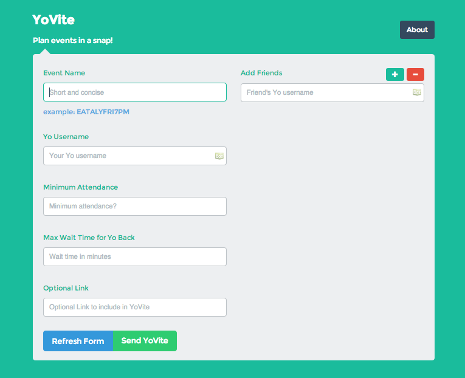
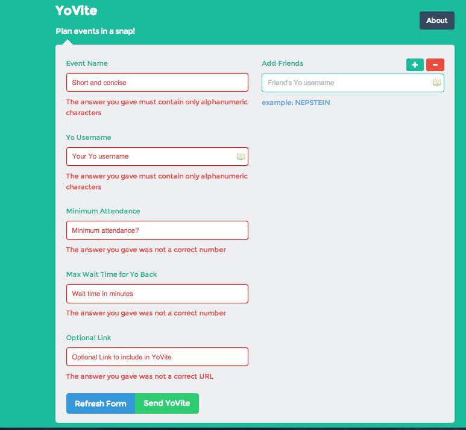
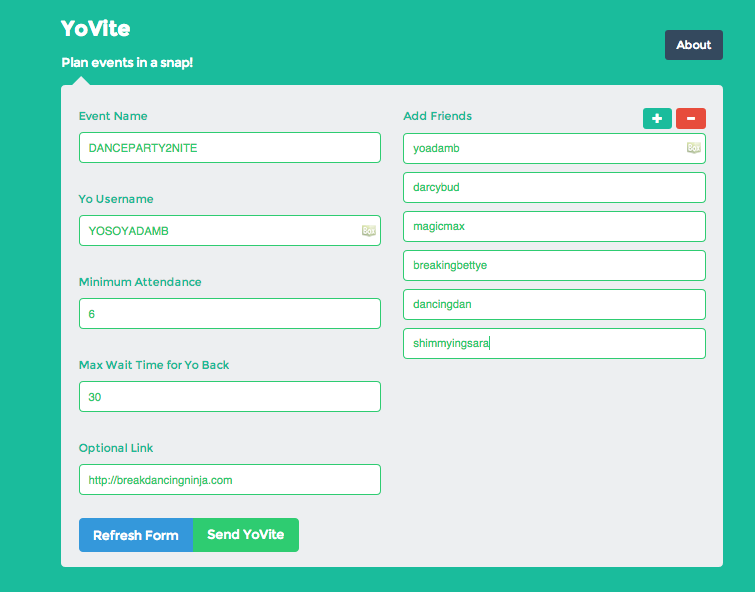

#YoVite
A Yo Hackathon project.  NYC Saturday June 26th 2014 at Bitly HQ.

#How to use
1. Clone this repo
2. `npm install`
3. `npm start`
4. Go to localhost:3000
5. Fill the form and send Yovite!

##Contributors
* Nathan Epstein (https://github.com/NathanEpstein)
* Christian (https://github.com/fnuchristian)
* Adam Barcan (https://github.com/Adam262)

##Technologies
###JavaScript
* NodeJS (http://nodejs.org)
* ExpressJS (http://expressjs.com)
* jQuery (http://jquery.com)

###CSS3
* Animate.css (http://daneden.github.io/animate.css/)

###HTML5

###Yo Dev (http://dev.justyo.co/)

#About
##What is YoVite?
YoVite is a meetup tool built on the YO platform. YoVite adds powerful but simple functionality that allows you to plan parties, games or dinners in just a few clicks.

##How does YoVite work?
YoVite is easy as 1-2-3.
* YOVITE
Fill out our simple form with a concise event name. List the YO usernames of your guest. Set the minimum attendence and the time you're willing to wait for your friends to confirm.

* YOBACK
Wait for your friends to YO back. Anybody who sends a YO back becomes a subscriber to your event.

* YO ON!
If you meet your minimum number of subscribers, event is on! You and all subscribers get a second YO. No second YO, no event.

##What problem does YoVite solve?</h4>
YoVite makes event planning quick and direct. Let's face it. Planning meetups is usually a drag. YoVite cuts the cross-firing texts and indecision that usually go along with planning a gettogether. Just send our quick form and wait for the YOBACK and YO ON!

##How should I make my event names?
Concise and meaningful. Like: SOCCER2NITECP, FRI730NATEAPT or DRINK2NITE8EATALY.

##Does YoVite require the YO app?
Yep. The host and all invitees need a YO username.

##Who are you?
Web developers at Fullstack Academy of Code (http://www.fullstackacademy.com).

###SCREENSHOTS
*Starting Page*

*Validation*

*Form Filled*

*YoVite Received*

#Possible Bug
* Right now, we actually don't need the API key from Yo.  Instead, we can generate our own API Key to interact with Yo backend.  In the near future, Yo developers might want to fix this issue, which will render our app obsolete.

* Form validator doesn't work with added new friends.
